# Line Drawing Library

This folder holds the processed line-drawing illustrations used by the AGC carousel system.

Every file is a **lossless WebP with a transparent background** — drop it onto any slide colour and the lines will read at full strength with no halo or rectangle. Do NOT add `mix-blend-mode: multiply` or sub-1 opacity in CSS (except for the documented "background ghost" placement, see the master prompt).

To preview what each illustration looks like on the actual slide canvas (#FAF7F2), open the matching file in `_previews/`.

To re-process from source: `node scripts/process-illustrations.js` from the repo root.

---

## Available illustrations (18)

| Slug | Description | Mood / use case | Preview |
|------|-------------|-----------------|---------|
| `determined-walk.webp` | Figure walking forward with purpose, alone, accountability mode. Self-directed. | determination, accountability, agency | 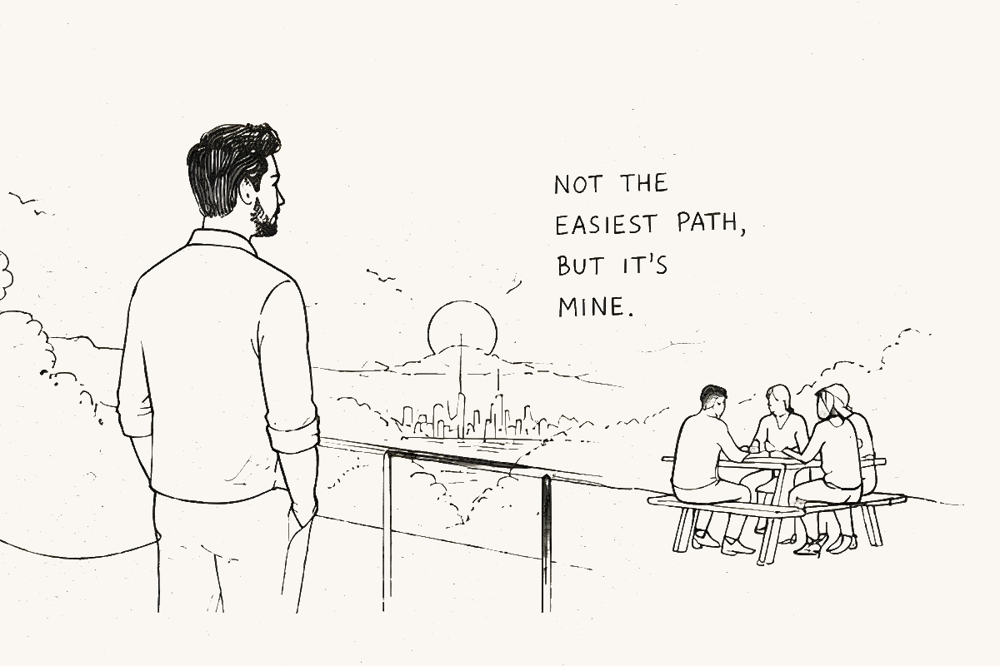 |
| `documents-standards.webp` | Documents being reviewed against Australian hiring standards. CV format, compliance. | compliance, standards, attention to detail | 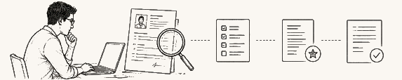 |
| `emotional-burden.webp` | Visual of the weight, the emotional toll of job hunting. Tired figure, heavy shoulders. | exhaustion, emotional weight, vulnerability | 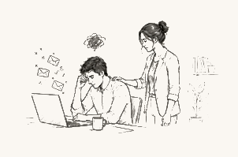 |
| `frustrated-laptop.webp` | Person at laptop, head in hands or visibly frustrated. Rejection, the old method failing. | frustration, defeat, stuck | 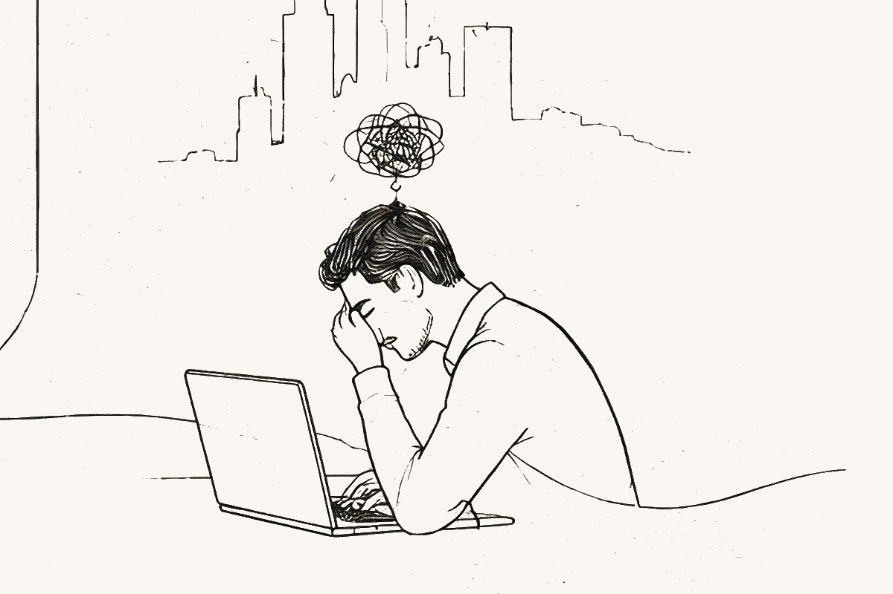 |
| `graduate-future.webp` | Graduate in cap and gown looking out at a city skyline, full of hope and possibility. | hopeful, aspirational, milestone |  |
| `grind-work.webp` | Person grinding through job hunt work — applications, planning, no clear feedback signal. | persistence, grind, ambiguity | 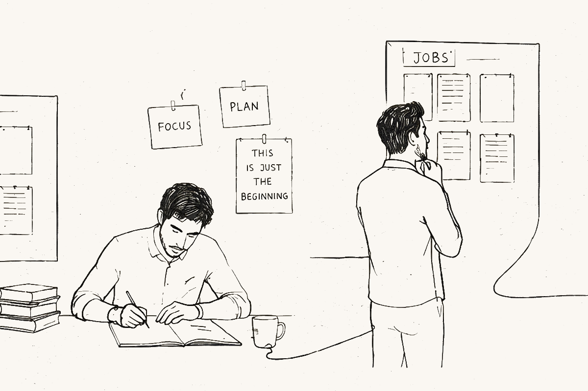 |
| `laptop-ambiguous.webp` | Person at a laptop working — neutral, ambiguous. Could illustrate any application-related concept. | neutral, focused, working | 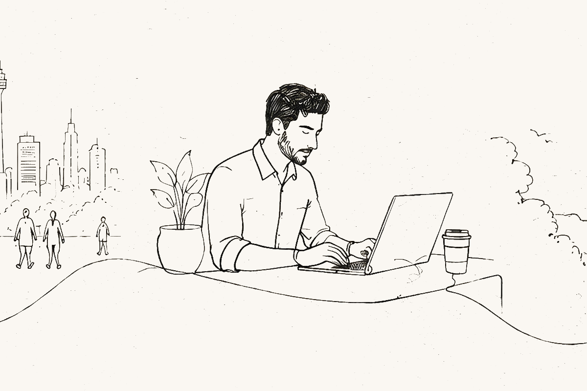 |
| `major-hurdle.webp` | Person facing a large rock/hurdle on one side, walking unburdened on the other. | obstacle, breakthrough, before-and-after |  |
| `mentor-session.webp` | Two people at a cafe table — mentor giving guidance to a job seeker. Coaching, advice. | guidance, mentorship, support | 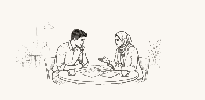 |
| `migrant-arrival.webp` | New arrival to Australia, optimistic about the future ahead. Suitcase, fresh start. | hopeful, fresh start, courage | 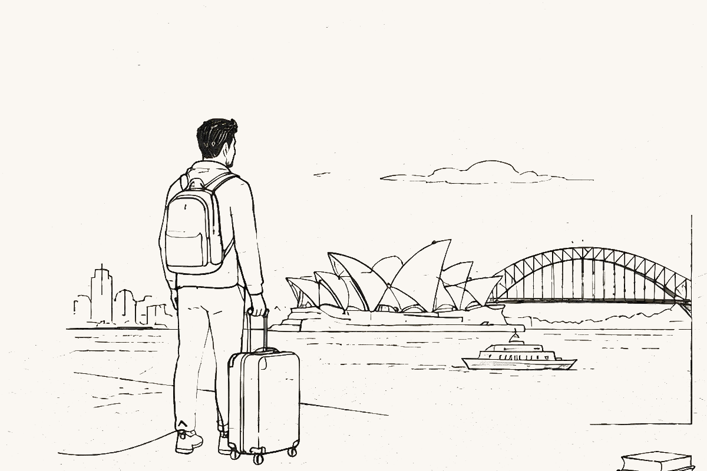 |
| `migrant-newcity.webp` | New arrival in a busy city — vivid sensory overwhelm, equal parts wonder and disorientation. | wonder, disorientation, newness | 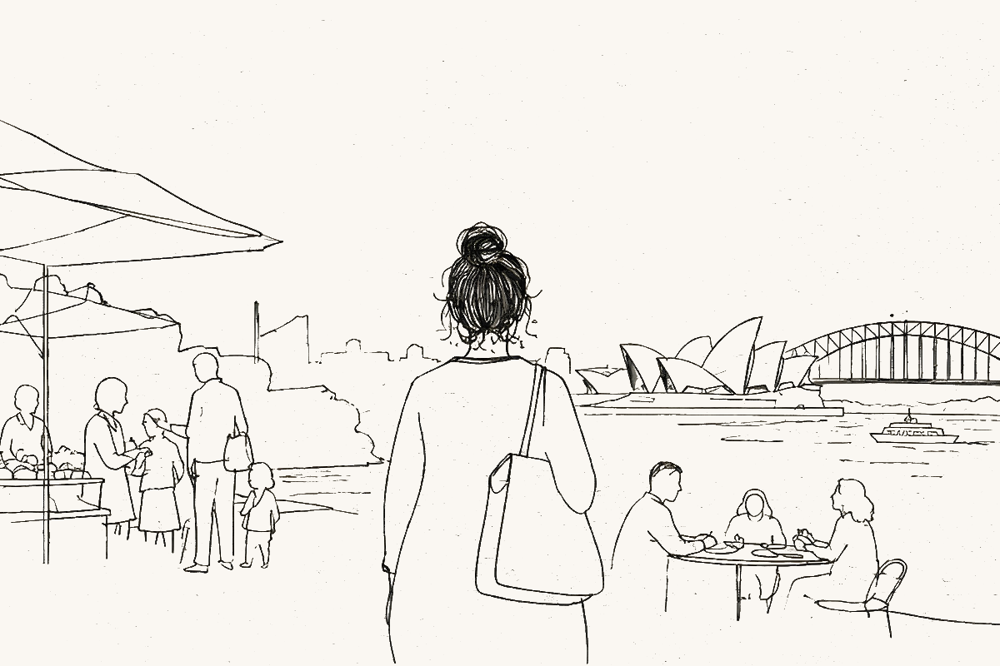 |
| `overwhelmed-woman.webp` | Woman at a laptop surrounded by tabs, options, post-its. Overwhelmed by choice. | overwhelm, decision fatigue, paralysis | 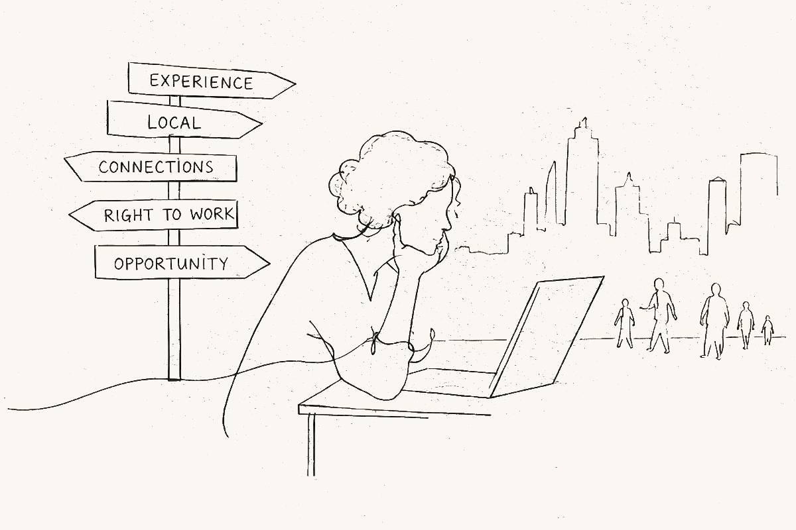 |
| `pensive-window.webp` | Young woman at a window holding a cup, looking out reflectively. "Maybe one day this will all be worth it." | reflective, quietly hopeful, patience | 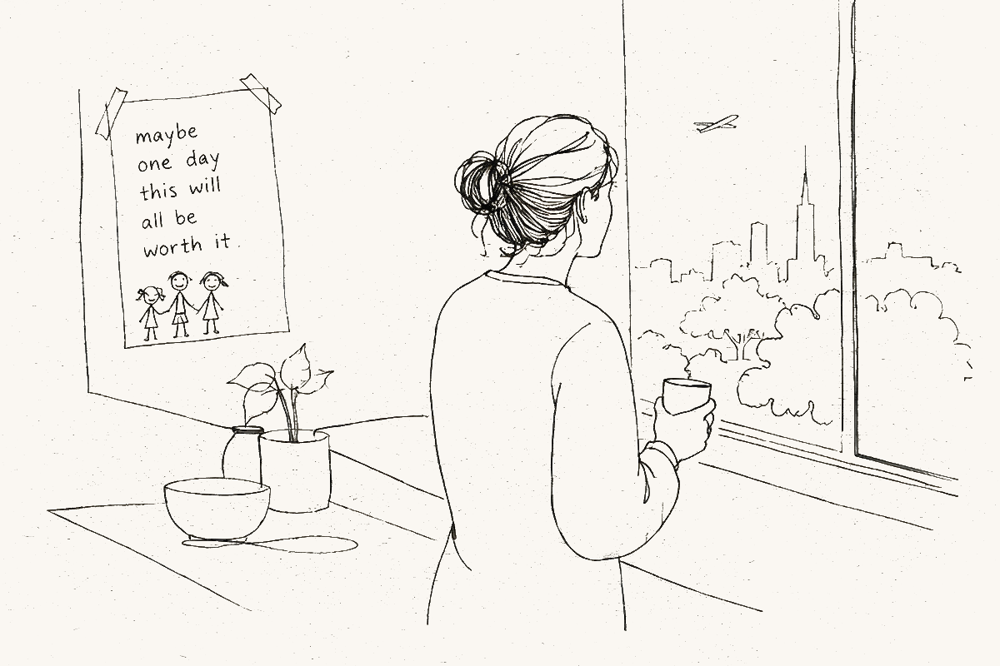 |
| `pipeline-stages.webp` | Horizontal pipeline: application → screen → interview → assessment → offer. Shows funnel. | analytical, diagnostic, process |  |
| `success-path.webp` | Figure walking towards a goal or arriving at success — positive forward motion. | optimistic, triumphant, momentum | 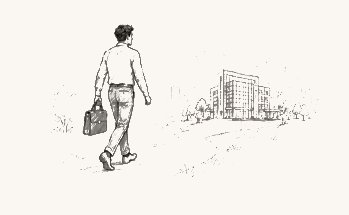 |
| `targeting-positioning.webp` | Visual metaphor for targeted aim — picking the right jobs, positioning strategically. | strategic, focused, intentional | 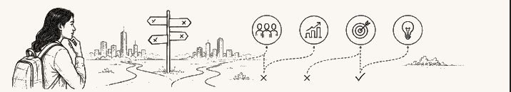 |
| `three-steps.webp` | Visual of 3 steps or 3 actionable items. Practical, list-shaped illustration. | actionable, practical, structured |  |
| `waiting-period.webp` | Man sitting on steps watching others walk towards the city. Stuck while others move on. | isolation, comparison, self-doubt | 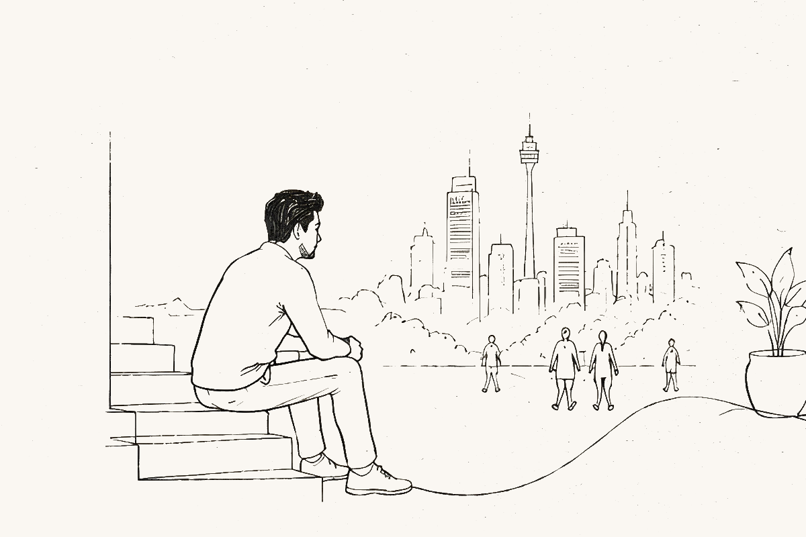 |

---

## How to reference in slide HTML

```html
.webp"
     alt="<one-line description of what the drawing depicts>"
     width="<px>" height="<px>"
     loading="eager">
```

Replace `<slug>` with one of the slugs in the table above (e.g., `frustrated-laptop`). Width/height should be set per the placement type defined in the master prompt:

- **Side panel**: 35–45% of canvas width
- **Corner accent**: 30–40% of canvas width, can bleed off by max 15%
- **Background ghost**: 60–80% of canvas width, `opacity: 0.12–0.18`

Do NOT add `mix-blend-mode` or further `opacity` reduction. The transparent background handles colour-matching automatically.
