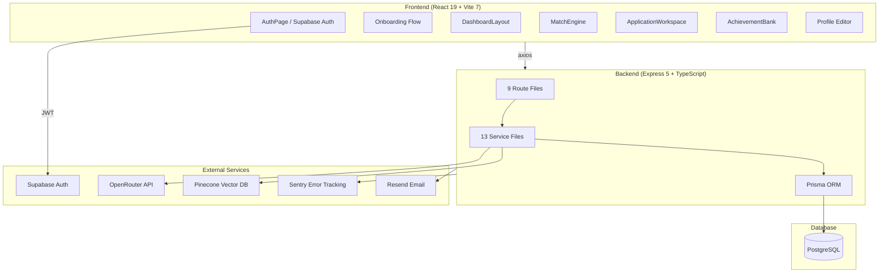
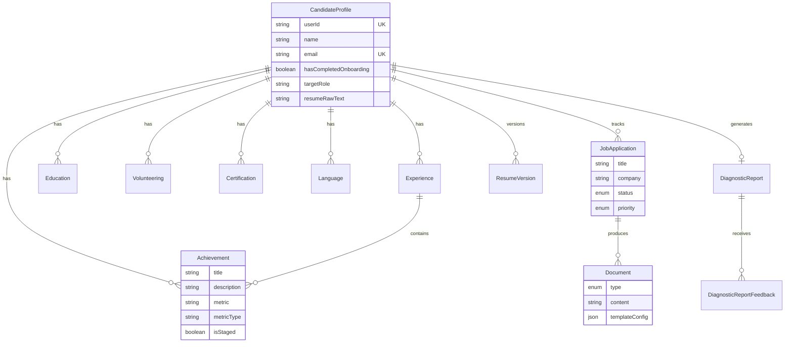

# JobHub — Comprehensive Project Evaluation

## Executive Summary

JobHub is a **job application productivity hub** that transforms raw resumes into structured career data, matches candidates against job descriptions using LLM intelligence, and generates tailored application documents (resumes, cover letters, STAR responses). The codebase is substantial (~200KB of application code across frontend and backend), with a clear product vision and a sophisticated multi-stage LLM architecture.

**Overall Assessment: Strong foundation, mid-stage MVP.** The core intelligence pipeline works, the data model is well-designed, and the hybrid LLM architecture (Claude + Llama) is thoughtfully planned. However, there are significant gaps in testing, deployment infrastructure, and code hygiene that need addressing before production readiness.

---

## Architecture Overview



---

## Tech Stack Analysis

### Frontend

| Technology | Version | Notes |
|---|---|---|
| React | 19.2.0 | Latest — uses new features |
| Vite | 7.3.1 | Latest major — very fast HMR |
| Tailwind CSS | 4.2.1 | v4 (CSS-first, no config file) |
| Framer Motion | 12.35.2 | Rich animations throughout |
| React Router | 7.13.1 | Client-side routing |
| TanStack Query | 5.90.21 | Server state management |
| Supabase JS | 2.99.1 | Auth + anonymous sign-in |
| React PDF Renderer | 4.3.2 | PDF generation |
| Lucide React | 0.577.0 | Icon library |
| Sonner | 2.0.7 | Toast notifications |

### Backend

| Technology | Version | Notes |
|---|---|---|
| Express | 5.2.1 | Latest v5 — breaking changes from v4 |
| Prisma | 6.19.2 | ORM with PostgreSQL |
| TypeScript | 5.9.3 | Shared across frontend/backend |
| Pinecone | 7.1.0 | Vector search for achievements |
| Zod | 4.3.6 | Runtime validation |
| Sentry | 10.45.0 | Error monitoring |
| Resend | 6.9.4 | Transactional email |
| pdf-parse | 1.1.1 | Resume PDF extraction |
| Mammoth | 1.12.0 | DOCX extraction |

---

## Data Model (Prisma Schema)



**12 models, 3 enums** — The schema is well-normalized with proper cascading deletes on `ResumeVersion`. The `CandidateProfile` is the anchor entity with a 1:1 relationship to Supabase Auth via `userId`.

### Onboarding Fields on CandidateProfile

The profile includes onboarding-specific fields (`targetRole`, `targetCity`, `seniority`, `industry`, `searchDuration`, `applicationsCount`, `channels`, `responsePattern`, `perceivedBlocker`) that capture the candidate's job search context. These feed into the diagnostic report.

---

## Server Architecture

### Route Files (9 total)

| Route | Size | Endpoint Base | Purpose |
|---|---|---|---|
| [analyze.ts](file:///e:/AntiGravity/JobHub/server/src/routes/analyze.ts) | 38KB | `/api/analyze` | JD analysis, match scoring, keyword alignment |
| [profile.ts](file:///e:/AntiGravity/JobHub/server/src/routes/profile.ts) | 34KB | `/api` | Profile CRUD, achievements, experience, education |
| [onboarding.ts](file:///e:/AntiGravity/JobHub/server/src/routes/onboarding.ts) | 12KB | `/api/onboarding` | Multi-step onboarding + diagnostic report |
| [generate.ts](file:///e:/AntiGravity/JobHub/server/src/routes/generate.ts) | 11KB | `/api/generate` | Document generation (resume, cover letter, STAR) |
| [research.ts](file:///e:/AntiGravity/JobHub/server/src/routes/research.ts) | 11KB | `/api/research` | Company/role research via Serper |
| [documents.ts](file:///e:/AntiGravity/JobHub/server/src/routes/documents.ts) | 5KB | `/api` | Document CRUD operations |
| [extract.ts](file:///e:/AntiGravity/JobHub/server/src/routes/extract.ts) | 4KB | `/api/extract` | Resume text extraction (PDF/DOCX) |
| [health.ts](file:///e:/AntiGravity/JobHub/server/src/routes/health.ts) | 190B | `/api/health` | Health check endpoint |
| [auth.ts](file:///e:/AntiGravity/JobHub/server/src/routes/auth.ts) | 84B | `/api/auth` | Auth endpoint (minimal) |

### Service Files (13 total)

| Service | Size | Purpose |
|---|---|---|
| [prompts.ts](file:///e:/AntiGravity/JobHub/server/src/services/prompts.ts) | 42KB | All LLM prompt templates |
| [autoExtract.ts](file:///e:/AntiGravity/JobHub/server/src/services/autoExtract.ts) | 7KB | Automated resume data extraction |
| [generation.ts](file:///e:/AntiGravity/JobHub/server/src/services/generation.ts) | 6KB | Document generation orchestration |
| [llm.ts](file:///e:/AntiGravity/JobHub/server/src/services/llm.ts) | 5KB | OpenRouter API integration |
| [diagnosticReport.ts](file:///e:/AntiGravity/JobHub/server/src/services/diagnosticReport.ts) | 5KB | Diagnostic report generation |
| [strategy.ts](file:///e:/AntiGravity/JobHub/server/src/services/strategy.ts) | 2KB | Claude strategy blueprint |
| [quality-gate.ts](file:///e:/AntiGravity/JobHub/server/src/services/quality-gate.ts) | 2KB | Quality gate review |
| [vector.ts](file:///e:/AntiGravity/JobHub/server/src/services/vector.ts) | 3KB | Pinecone vector operations |
| [serper.ts](file:///e:/AntiGravity/JobHub/server/src/services/serper.ts) | 2KB | Web search integration |
| [profile.ts](file:///e:/AntiGravity/JobHub/server/src/services/profile.ts) | 2KB | Profile service |
| [pdf.ts](file:///e:/AntiGravity/JobHub/server/src/services/pdf.ts) | 2KB | PDF parsing |
| [email.ts](file:///e:/AntiGravity/JobHub/server/src/services/email.ts) | 1KB | Email sending via Resend |
| [blueprint-cache.ts](file:///e:/AntiGravity/JobHub/server/src/services/blueprint-cache.ts) | 1KB | In-memory blueprint cache |

---

## Frontend Architecture

### Component Map (34 components)

| Category | Components |
|---|---|
| **Layout** | `DashboardLayout`, `Header`, `HeroSection` |
| **Onboarding** | `OnboardingFlow`, `OnboardingIntake` |
| **Profile** | `ProfileEditor`, `ProfileSection`, `ExperienceEditor`, `EducationEditor`, `SkillsEditor`, `VolunteeringEditor`, `CertificationsEditor`, `LanguagesEditor` |
| **Achievement Bank** | `AchievementBank`, `AchievementCard`, `AchievementStaging`, `AchievementForm`, `AchievementMiner` |
| **Match Engine** | `MatchEngine`, `JobDescriptionAnalysis` |
| **Applications** | `ApplicationTracker`, `ApplicationWorkspace`, `ApplicationDetail`, `ApplicationList` |
| **Document Gen** | `DocumentPreview`, `ResumePdfPreview`, `ResumeImporter`, `CoverLetterTab`, `ResumeTab`, `SelectionCriteriaTab` |
| **Diagnostics** | `DiagnosticReport` |
| **Auth** | `AuthPage` (in pages/) |
| **Shared** | `ProtectedRoute`, `ConfirmationDialog`, `RichTextBullets` |

### Authentication Flow

```
App.tsx → AuthContext → Supabase Auth
  ├── Anonymous sign-in (auto, for initial exploration)
  ├── Email/password sign-up → Profile creation via API
  ├── Magic link login
  └── Protected routes via ProtectedRoute component
```

> [!WARNING]
> **Anonymous sign-in is enabled.** The app automatically creates anonymous Supabase sessions. This means unauthenticated users get partial access. The `ProtectedRoute` component checks for non-anonymous auth status. If anonymous users accumulate data, there's no documented migration path when they convert to real accounts.

### Theme System

The app implements a **dual theme system** via `ThemeContext.tsx`:
- Light mode: Clean professional aesthetic
- Dark mode: Dark blue tones with glassmorphism effects
- CSS variables toggle between modes
- Proper `prefers-color-scheme` support

### API Service Layer

> [!CAUTION]
> **Duplicate API service files detected.** Both `src/services/api.ts` and `src/services/apiService.ts` exist. This creates confusion about which to import and risks inconsistent API behavior across components. One should be consolidated into the other.

---

## Intelligence Pipeline

### Current Flow (Implemented)

```
1. Resume Extract → Llama 3.3 70B (2-stage: structure + achievements)
2. JD Analysis → Llama 3.3 70B (match scoring + keyword alignment)
3. Document Gen → Hybrid (Claude strategy → Llama execution)
4. Diagnostic → Llama 3.3 70B (onboarding intake analysis)
```

### Hybrid LLM Architecture (Planned in plan.md, partially implemented)

The `plan.md` describes a sophisticated 3-stage document generation pipeline:

| Stage | Model | Purpose | Status |
|---|---|---|---|
| 1. Strategy Blueprint | Claude Sonnet 4 | Strategic framing, achievement selection | `strategy.ts` exists (2KB) |
| 2. Tactical Execution | Llama 3.3 70B | Document writing following blueprint | Exists in `generation.ts` |
| 3. Quality Gate | Claude Sonnet 4 | Review + surgical rewrite | `quality-gate.ts` exists (2KB) |

The blueprint caching system (`blueprint-cache.ts`) is implemented — keyed by `jobApplicationId` with 4-hour TTL.

---

## Identified Issues

### Critical

| # | Issue | Details |
|---|---|---|
| 1 | **Zero test coverage** | No test files exist in the project. `server/package.json` test script is `echo "Error: no test specified"`. No Jest, Vitest, or Playwright configured. |
| 2 | **No deployment infrastructure** | No Dockerfile, no docker-compose, no CI/CD workflows (GitHub Actions, etc.). The guiding document mentions Vercel but no config exists. |
| 3 | **No .env.example** | No `.env` or `.env.example` files committed. New developers have no reference for required environment variables. |

### High Priority

| # | Issue | Details |
|---|---|---|
| 4 | **Duplicate API services** | `api.ts` and `apiService.ts` both exist in `src/services/`. Should be consolidated. |
| 5 | **Large route files** | `analyze.ts` (38KB) and `profile.ts` (34KB) are monolithic. Should be split into controller + service + validation layers. |
| 6 | **Massive prompts file** | `prompts.ts` at 42KB is likely unmaintainable. Should be split by domain (extract, analyze, generate, diagnostic). |
| 7 | **In-memory blueprint cache** | Process restart clears all cached blueprints. Acceptable for MVP but will cause redundant Claude calls in production. |
| 8 | **Anonymous user data migration** | No documented path for migrating anonymous user data to authenticated accounts. |

### Medium Priority

| # | Issue | Details |
|---|---|---|
| 9 | **Console override in production** | `server/src/index.ts` overrides `console.log` and `console.error` to write to file. This is development-appropriate but blocks structured logging in production (conflicts with Sentry). |
| 10 | **CORS allows all localhost ports** | The regex `/^https?:\/\/localhost(:\d+)?$/` allows any localhost port. Fine for dev, should be restricted in production. |
| 11 | **No rate limiting** | No express-rate-limit or similar middleware. LLM endpoints are expensive and unprotected. |
| 12 | **Guiding document is stale** | References "SQLite for local development" but schema uses PostgreSQL. Mentions "Tailwind v4 architecture (no tailwind.config.js)" which is correct but the setup section says "Use `npx prisma db push`" — should be `npx prisma migrate dev`. |

### Low Priority

| # | Issue | Details |
|---|---|---|
| 13 | **Promptfoo configured but unused** | `package.json` has promptfoo eval scripts but no `evals/` directory found. |
| 14 | **Dev dependency in production** | `@types/file-saver` is in `dependencies` instead of `devDependencies`. |
| 15 | **Marketing fields on profile** | `marketingEmail`, `marketingConsent`, `marketingEmailSent` on CandidateProfile suggest planned email marketing but no implementation visible. |

---

## Feature Completeness Matrix

| Feature | Status | Notes |
|---|---|---|
| **Supabase Auth** | ✅ Complete | Email/password, magic link, anonymous |
| **Resume Upload/Extract** | ✅ Complete | PDF + DOCX, 2-stage LLM extraction |
| **Profile Management** | ✅ Complete | Full CRUD for all profile sections |
| **Achievement Bank** | ✅ Complete | Mining, staging, tagging, Pinecone vectors |
| **Match Engine** | ✅ Complete | JD analysis, scoring, gap analysis |
| **Document Generation** | ✅ Complete | Resume, cover letter, STAR responses |
| **Hybrid LLM Pipeline** | 🔶 Partial | Strategy + quality gate files exist but small |
| **Application Tracker** | ✅ Complete | CRUD, status management, priority tiers |
| **Diagnostic Report** | ✅ Complete | Onboarding intake → LLM analysis → markdown report |
| **PDF Preview/Export** | ✅ Complete | @react-pdf/renderer integration |
| **Company Research** | ✅ Complete | Serper web search integration |
| **Onboarding Flow** | ✅ Complete | Multi-step intake with coaching |
| **Dark/Light Theme** | ✅ Complete | CSS variable-based toggle |
| **Error Monitoring** | ✅ Complete | Sentry on both frontend and backend |
| **Email Notifications** | 🔶 Partial | Resend configured, marketing fields exist |
| **Live PDF Preview** | ✅ Complete | Listed as future in guiding doc, now built |
| **Chrome Extension** | ❌ Not started | Listed in roadmap |
| **Testing** | ❌ Not started | Zero test coverage |
| **CI/CD** | ❌ Not started | No workflows or deployment config |

---

## Strengths

1. **Well-designed data model** — The Prisma schema is clean, properly normalized, and covers the full problem domain well. The Achievement-Experience relationship and the Document-JobApplication relationship are particularly well-thought-out.

2. **Sophisticated LLM architecture** — The hybrid Claude-as-strategist, Llama-as-executor design in `plan.md` is genuinely innovative and cost-effective. The blueprint caching strategy is smart.

3. **Rich frontend UX** — 34 components with Framer Motion animations, glassmorphism design, dual themes, and @react-pdf/renderer for live previews shows significant UX investment.

4. **Proper error monitoring** — Sentry integrated on both frontend and backend with proper error handling middleware.

5. **Strong product vision** — The `guiding_document.md` and `plan.md` show clear product thinking — this isn't a generic CRUD app but a purposeful tool with strategic differentiation.

---

## Recommended Next Steps (Priority Order)

1. **Add `.env.example`** for both frontend and server with all required variables documented
2. **Consolidate duplicate API services** — merge `api.ts` and `apiService.ts`
3. **Add basic testing** — start with Vitest for server route handlers and critical services
4. **Add rate limiting** on LLM-facing endpoints (`/api/generate`, `/api/analyze`, `/api/extract`)
5. **Create Dockerfile** and basic deployment config (Vercel for frontend, Railway/Render for backend)
6. **Split large files** — break `prompts.ts`, `analyze.ts`, and `profile.ts` into smaller modules
7. **Update guiding document** to reflect current state (PostgreSQL, not SQLite; features complete)
8. **Add CI workflow** — at minimum a lint + typecheck + build verification pipeline
